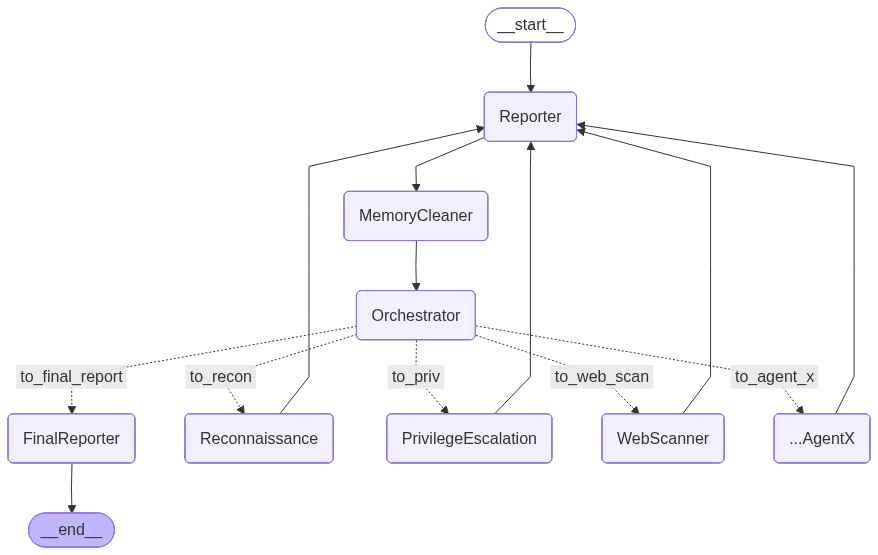

# Maestro

**Maestro** è un framework multi-agente per l’automazione del penetration testing, basato su **LangGraph** e **LangChain**.  
Il sistema implementa un workflow a grafo ispirato al ciclo classico del penetration test (Reconnaissance → Scanning → Exploitation → Privilege Escalation → Reporting), orchestrato da un supervisore centrale e supportato da moduli dedicati.



---

## 🚀 Caratteristiche principali

- **Architettura multi-agente**: ogni fase del pentest è gestita da un ReAct agent specializzato.
- **Orchestrator**: Decide quale esperto eseguire.
- **Workflow a grafo**: costruito con [LangGraph](https://python.langchain.com/docs/langgraph), permette di orchestrare fasi, cicli e condizioni di stop.
- **Reporter**: aggiorna un `shared_report.json` strutturato, riducendo ridondanza e allucinazioni.
- **Memory Cleaner**: sintetizza la cronologia dei messaggi, mantenendo solo il contesto utile.
- **Self-RAG Tool**: knowledge base vettoriale (FAISS) per fornire suggerimenti affidabili agli agenti.
- **Terminal Tool**: esecuzione di comandi non interattivi in sandbox.
- **Human Tool**: possibilità di chiedere supporto manuale all’operatore quando l’agente ha dubbi.
- **SSH Tool**: fornisce un interfaccia facilitata per ssh non interattivo.
- **Final Reporter**: genera un report finale leggibile, simile a un penetration test report professionale.

---

## 📂 Struttura del progetto

```

Maestro/
│
├── agents/                 # Definizione degli agenti (Recon, Scan, Exploit, PrivEsc, Reporter, Orchestrator, ecc.)
│   ├── React/
|   |────ReAct_agent.py
|   |──state.py #contiene lo stato del workflow
│   └── Coordinators/       # Moduli di supporto (es. MemoryCleaner)
│
├── tools/                  # Tool integrati (terminal\_tool, self\_rag\_tool, human\_tool, ecc.)
│
├── prompts.py              # Prompt usati dagli agenti
├── main.py                 # Entry point: costruisce e avvia il grafo
├── requirements.txt        # Dipendenze Python
└── README.md               # Questo file

````

---

## ⚙️ Requisiti

- **Python 3.10+** (testato anche su 3.13)
- [LangChain](https://python.langchain.com)
- [LangGraph](https://python.langchain.com/docs/langgraph)
- API_KEY valida per il modello
- FAISS
- pydantic
- dotenv

Installa le dipendenze con:

```bash
pip install -r requirements.txt
````

---

## ▶️ Esecuzione

1. Clona la repo

2. Crea un file `.env` con la tua chiave per il modello:

   ```env
   OPENAI_API_KEY=sk-...
   ANTHROPIC_API_KEY=...
   ```

3. Avvia il grafo:

   ```bash
   python -m main
   ```

Durante l’esecuzione, gli agenti:

* leggono lo `shared_report` come contesto,
* propongono ed eseguono comandi tramite `terminal_tool`,
* aggiornano il report tramite `reporter_agent`,
* possono chiedere supporto manuale tramite `human_tool`.

Al termine, il **Final Reporter** produrrà un report leggibile della sessione.

---

## 📖 Documentazione

* **Agents**

  * Reconnaissance Agent
  * Privilege Escalation Agent
  * Web Scanning Agent
  * Reporter & Final Reporter
  * Orchestrator
  * Memory Cleaner

* **Tools**

  * Shell Tool
  * SSH tool
  * Self-RAG Tool (FAISS vector DB)
  * Human Tool (intervento umano)

---

## 🧪 Esempio di flusso

1. **Reconnaissance** → ping, nmap, scoperta servizi
2. **Web Scanning** → esperto di exploit siti web.
3. **Privilege Escalation** → ricerca di escalation a root
5. **Reporter** → aggiorna lo stato
6. **Memory Cleaner** -> pulisce il contesto
7. **Final Reporter** → genera un report conclusivo

---

## ⚠️ Disclaimer

Maestro è un progetto di ricerca sviluppato a scopo didattico e di sperimentazione.
Non deve essere utilizzato contro sistemi o reti senza autorizzazione esplicita.
L’autore declina ogni responsabilità per un uso improprio del codice.

---

## 📜 Licenza

# MIT License
```
Copyright (c) 2025 Unical Demacs and Dimes Departments

Permission is hereby granted, free of charge, to any person obtaining a copy  
of this software and associated documentation files (the "Software"), to deal  
in the Software without restriction, including without limitation the rights  
to use, copy, modify, merge, publish, distribute, sublicense, and/or sell  
copies of the Software, and to permit persons to whom the Software is  
furnished to do so, subject to the following conditions:

The above copyright notice and this permission notice shall be included in all  
copies or substantial portions of the Software.

THE SOFTWARE IS PROVIDED "AS IS", WITHOUT WARRANTY OF ANY KIND, EXPRESS OR  
IMPLIED, INCLUDING BUT NOT LIMITED TO THE WARRANTIES OF MERCHANTABILITY,  
FITNESS FOR A PARTICULAR PURPOSE AND NONINFRINGEMENT. IN NO EVENT SHALL THE  
AUTHORS OR COPYRIGHT HOLDERS BE LIABLE FOR ANY CLAIM, DAMAGES OR OTHER  
LIABILITY, WHETHER IN AN ACTION OF CONTRACT, TORT OR OTHERWISE, ARISING FROM,  
OUT OF OR IN CONNECTION WITH THE SOFTWARE OR THE USE OR OTHER DEALINGS IN THE  
SOFTWARE.
```
